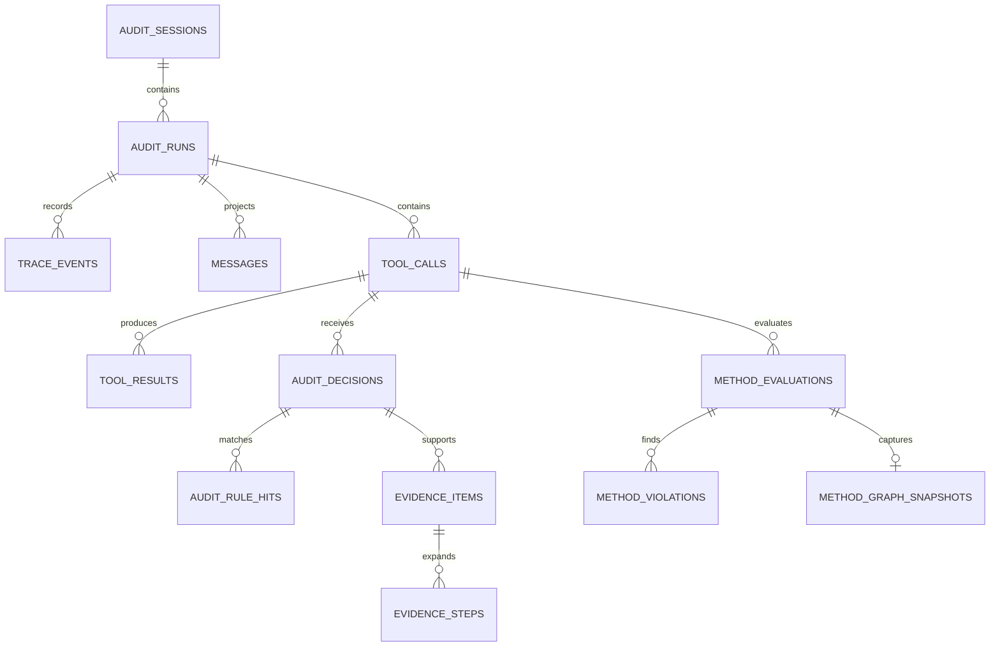

# 数据模型

TraceShield 使用 PostgreSQL 作为审计事实存储。基础结构位于 `core/src/db/schema.sql`，运行顺序与 Method 字段由递增迁移扩展。

## 实体关系



## 14 张业务表

### audit_sessions

以 `session_id` 为主键，保存首次和最后出现时间及 JSONB metadata。删除 session 会级联删除其 runs 和大部分下游数据。

### audit_runs

以 `run_id` 为主键并关联 session，保存 `trace_id`、生命周期、工具/决策聚合和最高风险。有效状态为：

```text
active | completed | failed | timed_out | abandoned
```

当前自动逻辑只在 `agent_end` 时从 active 转为 completed。

### trace_events

保存八类通用事件的信封和可选 raw payload。`event_id` 是幂等键，schema 固定 `v1`，mode 为 `sync` 或 `async`。

### messages

是消息类 trace event 的结构化投影，保存 role、preview、hash、summary 和 metadata。`event_id` 唯一，因此同一事件不会重复投影。

### tool_calls

保存同步审计对应的工具调用。核心字段包括工具名/种类、顺序、参数摘要、资源提示、风险提示和状态。`request_id` 唯一，`run_id + step_seq` 在 step 非空时唯一。

### tool_results

保存结果预览、哈希、摘要、错误、耗时及 observation 注入检测字段。原始结果是否保存由环境开关决定。

### audit_decisions

保存动作、风险、理由、规则 ID、策略版本、证据引用、审批描述、执行引擎和版本。`request_id` 唯一保证同步审计幂等。

### policies

保存四条默认策略的展示目录、enabled、priority、动作、风险和 JSON config。当前实际决策引擎没有读取此表；它不是运行时动态配置源。

### audit_rule_hits

按 decision 和 policy ID 记录命中明细。`policy_id` 没有外键，因此可保存 `default_allow` 或 Method 产生的规则标识。

### evidence_items / evidence_steps

一条同步审计决策创建一项 evidence，并展开为三个有序步骤。step 在同一 evidence 内按 `step_order` 唯一。

### method_evaluations

保存 profile/version、状态、建议、风险、延迟、差异类型、完整性、输入哈希、错误和 revision。完整 Method 输入不持久化，只保存 SHA-256。

### method_violations

保存违规类型、来源、理由、目标、关联步骤、是否涉及当前工具和额外 metadata。

### method_graph_snapshots

每个 evaluation 最多一张 JSONB 图快照，包含 nodes 与 edges。

## 时间与顺序

- 插件事件时间使用 Unix 毫秒，Core 转换为 `TIMESTAMPTZ`。
- 数据库 `created_at` 表示入库时间，事件 `occurred_at` 表示源发生时间。
- 工具主链应以 `step_seq` 为逻辑顺序；缺失时 legacy 图按 `started_at` 和 ID 排序。
- 会话与运行的 `last_seen_at` 使用更晚的事件时间或当前审计时间更新。

## 删除与保留

当前外键大量使用 `ON DELETE CASCADE`，便于删除一条测试 session 的整套证据。但项目尚未实现数据保留周期、归档或清理任务。生产化前需要明确：

- 审计保存期限；
- 删除审批与法律留存；
- 大 JSONB 图快照的容量策略；
- 插件磁盘队列的容量与清理；
- 备份、恢复和迁移回滚方案。

## 原始与派生数据

| 数据 | 默认保存 | 说明 |
| --- | --- | --- |
| `raw_payload` | 否 | 由 `TRACESHIELD_SAVE_RAW_PAYLOAD` 控制 |
| `raw_params` | 否 | 由 `TRACESHIELD_SAVE_RAW_PARAMS` 控制 |
| `raw_result` | 否 | 由 `TRACESHIELD_SAVE_RAW_RESULT` 控制 |
| 参数摘要 | 是 | 仍可能包含预览，必须在插件侧脱敏 |
| 资源提示 | 是 | 用于策略与调查，可能包含路径/URL |
| 消息/结果预览 | 是 | 最多 4000 字符，不能等同于无敏感内容 |
| 哈希、规则和理由 | 是 | 用于关联与证据 |

关闭 raw 并不意味着数据库中绝无内容。Core 信任上游插件已经完成规范化与脱敏；新增生产者时必须复用同等保护。

## 连接池与事务

连接池最大 10，空闲超时 30 秒，连接超时 3 秒。同步审计的主记录在一个事务内；一个事件 batch 也使用一个整体事务。

数据库层不负责调用 Method 或外部模型。网络/子进程调用应在事务外完成，避免长事务占用连接。

## 迁移模型

`npm --prefix core run db:migrate`：

1. 开启事务；
2. 执行基础 schema；
3. 按文件名执行 `migrations/*.sql`；
4. upsert 默认 policies；
5. 提交。

当前没有 migration history 表，因此所有 SQL 必须保持可重复执行。新增迁移不要修改已经发布的旧文件。

