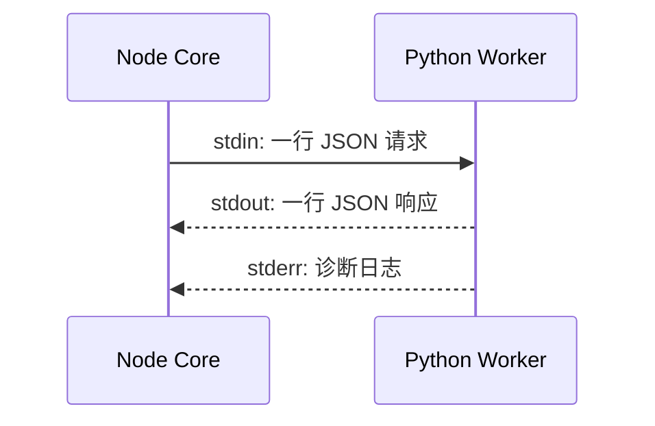
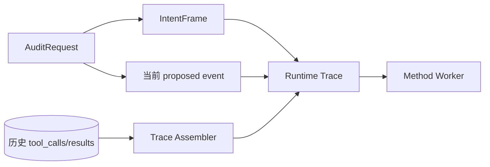

# 方法引擎

Method Engine 是由 Core 管理的长期 Python 子进程。它读取当前用户意图、同一 Run 的历史工具轨迹和待执行步骤，生成语义映射、违规、运行时建议与风险图。

## 运行模式

| 模式 | Worker | 同步裁决来源 | Method 结果用途 |
| --- | --- | --- | --- |
| `legacy` | 不启动 | TypeScript 基础规则 | 无 Method evaluation |
| `shadow` | 启动，后台队列 | TypeScript 基础规则 | 差异、违规、延迟、图谱；不改变本次执行 |
| `enforce` | 启动，同步调用 | Method + safety floor；异常回退基础规则 | 参与执行并持久化评估 |

默认是 `shadow`，这是理解控制台的关键：看到 Method 风险图不意味着 Method 已改变当时的工具决定。

## 进程与协议



协议版本固定 `v1`，每个消息带独立 `request_id`。支持：

- `health`
- `evaluate_runtime_trace`
- `detect_observation`
- `shutdown`

Core 可以并发挂起请求并按 ID 关联响应；单行响应最大 4 MiB。Worker 异常退出会让所有挂起调用失败，然后按 100 ms 起步、最大 5 秒的指数退避自动重启。正常关闭先发送 shutdown，1 秒后仍未退出才强制结束。

## 输入构建



### IntentFrame

当前 live 路径优先把 `context.user_goal` 作为高置信任务目标。没有目标时使用空意图、低置信。允许的常规动作包含列表、读取、摘要、状态读取和最终回答；敏感/禁止资源基线包含 `.env`、私钥与 `/etc/shadow` 等。

数据库已经预留 intent/profile 字段，但当前运行链尚未回写这些字段。`recent_message_hashes` 虽被公开 Audit API 接受，也尚未用于 live IntentFrame。

### 轨迹完整性

Core 查询 `step_seq` 小于当前步骤的工具及其最新结果，再追加当前 pending 事件。完整性：

- `complete`：步骤连续且历史 observation 完整；
- `missing_steps`：不是严格 `1,2,3...`；
- `previous_observation_pending`：历史步骤未完成或缺少 observation hash。

## 工具语义映射

映射按优先级执行：工具名精确匹配 → 不区分大小写匹配 → `tool_kind` fallback → unknown。

| 来源 | 置信度 |
| --- | --- |
| registry 精确匹配 | `1.0` |
| tool kind fallback | `0.7` |
| unknown | `0.0` |

unknown 会映射为高风险未知调用，并通常得到 `ASK`。

## 检测维度

### 能力边界

检查高风险动作是否超出用户目标允许的动作集合，产生 `intent_tool_inconsistency`。

### 资源边界

检查目标是否命中禁止资源，或越过允许资源范围并涉及敏感/高风险行为，产生 `intent_resource_inconsistency`。

### 精确授权边界

底层方法支持对收款人、金额、收件人、频道、预订目标、文件 ID、URL 等做参数级精确授权。但当前公开 AuditRequest 不能传 `authorized_risky_calls`，因此 live OpenClaw 链路尚未贯通该能力。

### 语义关系

把步骤与用户目标判为 `entailed/supported/uncertain/unrelated/contradiction`。高影响动作只有在与目标无关或矛盾时才形成对应违规。

### 步骤转换

根据前后语义动作检查是否存在合理转换。第一步不检查；不允许的转换只有在当前动作高风险/禁止时才形成 `step_step_inconsistency`。

### 提示注入诱导漂移

Observation 检测会归一化 Unicode、空白和部分变体，匹配中英文注入信号并计算分数。当注入证据之后出现网络、发送、Shell、删除、凭据写入或金融修改等危险动作时，生成 `prompt_injection_induced_drift`。

### 敏感数据外流链

引擎跟踪敏感资源读取，经摘要、计算、过滤、聚合、写文件等转换继续传播；到达网络、外部发送或 Web 提交时生成 `chain_semantic_drift`。标明已脱敏、已匿名、仅聚合、仅公开来源或明确排除敏感源的转换可以形成 provenance barrier。

## 四级建议映射

底层 evaluator 的允许/拒绝结果会转换为运行时四级动作：

| 条件 | 建议 |
| --- | --- |
| 当前步骤存在 hard violation，且动作至少 medium | `BLOCK` |
| 当前步骤有其他违规，且动作 high/critical | `ASK` |
| 当前步骤有其他违规 | `WARN` |
| 工具完全 unknown | `ASK` |
| 映射置信度低于 0.8 | `WARN` |
| 只有历史违规 | `WARN` |
| 无违规且映射可靠 | `ALLOW` |

Hard violation 包括注入诱导漂移、敏感链漂移和意图资源不一致。Method 产生 ASK 时同样使用 30 秒、默认 BLOCK 的审批描述。

## enforce 安全底线

Method 建议与 safety floor 按以下严重度比较：

```text
ALLOW < WARN < ASK < BLOCK
```

明确敏感文件访问至少 BLOCK；明确破坏性磁盘命令至少 ASK。Method 不能把它们下调。任何 Method 异常都会回退基础规则，避免 Worker 故障直接造成同步链失败。

## Shadow 生命周期

状态为：

```text
queued | running | ok | timeout | error | unavailable
```

Core 先创建 evaluation 并保存输入 SHA-256，然后异步执行；成功写 suggestion、风险、延迟、diff、violations 和 graph snapshot。队列满时记录 `unavailable/shadow_queue_full`。默认队列上限为 256，Core 关闭最多等待队列 2 秒。

Observation 到达后可以触发 revision 递增的重新评估。唯一组合为 `request_id + profile + method_version + evaluation_revision`。

## 图谱

Method 图包含用户意图、工具步骤和策略违规节点；边主要是正常 `flow` 与风险 `blocked_by`。Core 的 `/risk-graph` 优先返回最新成功 Method snapshot，没有时才生成 legacy 线性图。

## 开发与验证

```bash
npm --prefix core run method:test
npm --prefix core run method:health
npm --prefix core run method:replay
npm --prefix core run method:report
```

`method:replay` 与 `method:report` 会向仓库报告目录写文件，不是纯只读命令。修改规则或映射时，至少验证公开读取、危险 Shell、未知工具、敏感读取、注入外发、provenance barrier、乱序和敏感到网络链路。

## 当前边界

- live 请求不能传精确风险授权。
- live IntentFrame 尚不使用 recent message hash。
- shadow 队列与待应用 Observation 都在进程内存，重启会丢失未处理项。
- profile 与 method version 字段已记录，但 Worker 当前只接受项目的默认 runtime profile。
- 数据库部分语义列已经预留，但 live 路径尚未写入。
- Web 当前没有监听 Method 专用 SSE 事件。

