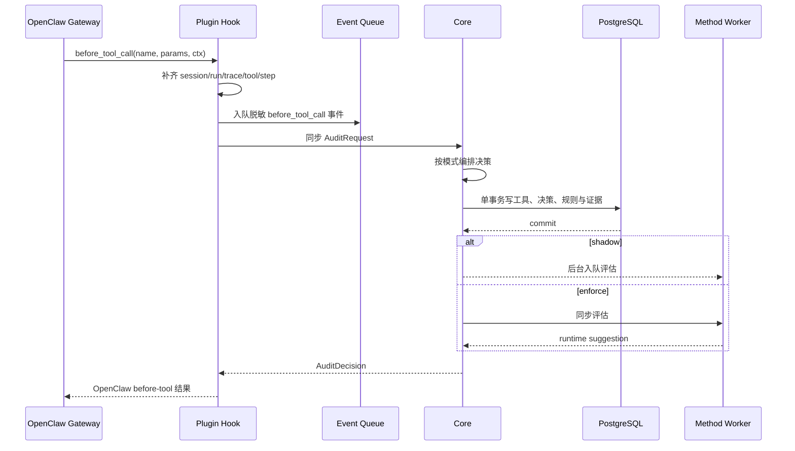
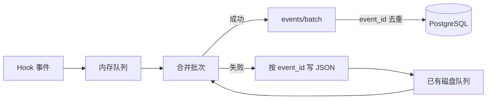

# 运行时请求链

本页跟踪一条工具调用从用户意图到最终证据的完整生命周期。

## 1. 会话与运行关联

OpenClaw Hook 原始上下文不一定总能提供完整标识符。插件的 Run Context Registry 负责维护：

- `session_id`：一个持续对话或 Agent 会话。
- `run_id`：一次 Agent 运行。
- `trace_id`：跨消息、工具和结果的关联轨迹。
- `tool_call_id`：单次工具调用。
- `step_seq`：同一 Run 内从 1 开始的工具顺序。
- `correlation_source`：标识关联值来自宿主 ID 还是插件推导。

Core 在 `run_id + step_seq` 非空时建立唯一约束，防止同一运行出现两个相同步骤。

## 2. before_tool_call

插件同时做两件事：把规范化事件放入异步队列，并把带原始参数的审计请求同步发给 Core。两者目的不同；前者建立遥测，后者决定是否执行。

## 3. Core 事务

Core 先按 `request_id` 查找既有决策。重复请求直接返回原决策，不重新创建证据。

新请求在同一个数据库事务内完成：

1. upsert session；
2. upsert run；
3. upsert tool call，状态设为 `pending`；
4. 插入 decision；
5. 为每条命中规则插入 rule hit；
6. 创建 evidence item；
7. 创建三个 evidence step；
8. 回写 evidence refs；
9. 重算 Run 聚合；
10. 提交。

任何一步数据库失败都会回滚本次同步审计主记录。事务提交后路由才发布 `audit_event` 并返回响应。

## 4. 决策映射

插件将 Core 响应转换为 OpenClaw Hook 语义：

| Core 决策 | 插件返回 | 预期宿主行为 |
| --- | --- | --- |
| `ALLOW` | `undefined` | 正常执行 |
| `WARN` | 通常不阻断，并保留 warning 元数据 | 执行并记录告警 |
| `ASK` | `requireApproval` | 展示审批；默认超时 deny |
| `BLOCK` | `{ block: true, blockReason }` | 工具不执行 |
| 包含 `modified_params` | `{ params: ... }` | 使用修改后的参数；当前 Core 尚不签发 |

阻断理由以 `TraceShield BLOCKED` 开头，并明确写入“工具未执行”。安全中间件还会把这一事实追加到模型上下文和工具结果，降低模型把阻断误报成完成的概率。

## 5. 审计超时与本地 fallback

插件默认给 Core `400 ms` 同步预算；Hook 本身的超时比它多 `200 ms`。请求超时、网络错误、非 2xx 或响应无法解析都会进入 fallback：

- 敏感读取：`BLOCK/critical`。
- 高风险工具种类：`BLOCK/critical`。
- 低风险只读且命中本地 allow cache：`ALLOW/low`。
- 其他：`ASK/medium`，30 秒后默认 `BLOCK`。

fallback 决策会生成 `fallback_decision` 异步事件。它和 Core 在 enforce 模式下回退 legacy 是不同层次：前者发生在插件无法得到可用 Core 响应，后者发生在 Core 内部 Method 不可用。

## 6. after_tool_call

工具执行成功或失败后，插件立即：

1. 关联原 `tool_call_id` 与 `step_seq`；
2. 规范化结果预览、摘要、哈希、错误和耗时；
3. 把 `after_tool_call` 放入事件队列；
4. 若有结果，异步调用 Method observation 检测。

事件批次到达 Core 后，`tool_results` 被写入，原工具状态更新为 `completed` 或 `error`。Observation 检测会补充注入标记、分数、原因和 observation hash。

## 7. 事件 flush 与补传

默认每 `2000 ms` 执行一次 flush，批次最多 100 条：

上报成功后删除已发送磁盘文件。上报失败且磁盘写入也失败时，事件重新放回内存。磁盘文件采用先写临时文件再 rename 的方式，减少半写文件。

## 8. agent_end

新插入的 `agent_end` 事件会把 Run 标为 `completed`，记录 `ended_at` 和 `end_reason=agent_end`。当前没有后台任务自动把长期未结束的 Run 标为 `timed_out` 或 `abandoned`。

## 9. 控制台更新

- 同步决策提交后发布 `audit_event`。
- 新异步事件入库后发布 `trace_event`。
- Method shadow 生命周期发布 queued/completed/failed 事件。
- 本地 HTTP 控制台使用 EventSource；断线后浏览器按服务端 `retry: 3000` 自动重连。
- HTTPS 展示入口当前每 10 秒刷新快照，不连接 SSE。

SSE 没有持久游标或历史补发。断线窗口内发生的事件，要靠重新查询会话、调用和图谱恢复，而不是依赖 SSE 重放。

## 10. 时序异常

系统允许事件重试与一定程度乱序，但仍有需要关注的边界：

- `after_tool_call` 先于同步 audit 到达时，Core 会建立 `unknown` placeholder；极端乱序下状态可能继续保留为 `unknown`。
- Observation 先于 tool result 入库时暂存在 Core 内存；Core 重启会丢失尚未应用项。
- 同一事件批次在一个事务中，一条数据库错误会让整个批次回滚。
- `request_id` 与 `event_id` 必须长期唯一，否则会被判定为重试并忽略新内容。

