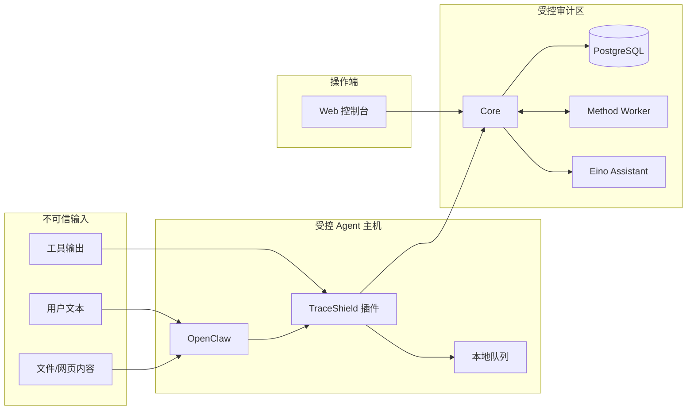

# 安全与信任边界

TraceShield 是安全组件，但当前仓库本身不是完整的公网多租户平台。理解每条边界，才能避免把局域网开发假设带到生产环境。

## 信任区域

用户输入、外部文档和工具输出一律视为不可信。即使内容作为 Assistant `context` 放进 system message，它也只是证据，不是指令。

## 执行边界

真正决定工具是否继续的是 OpenClaw 的 `before_tool_call` 返回值。Core 给出决策，插件负责把它映射为宿主能执行的 block/approval/params 语义。

安全不应依赖以下非权威元素：

- Web 页面是否打开；
- 前端策略开关；
- Assistant 的自然语言建议；
- SSE 是否在线；
- Overview 的展示数字。

## 网络边界

### Core

Core 当前监听 `0.0.0.0`，全局 CORS 为 `*`，没有登录、API token、租户或角色权限。它只适合放在受控本机/私网，或置于带认证与路径策略的反向代理之后。

### Assistant

Assistant 默认监听 `127.0.0.1:8790`，浏览器通过 Core 访问。这样模型 API key 不进入前端，也不需要直接开放 Assistant 端口。

### PostgreSQL

开发 Compose 将 `5432` 映射到宿主。生产环境应移除不必要的宿主映射或使用防火墙严格限定来源。

### 公共展示网关

仓库的公共网关只允许只读方法和 `POST /v1/assistant/chat/stream`，拒绝其他写路径，并让 Runtime 使用轮询。它是演示边界，不替代正式身份系统。

## 最小数据原则

插件负责在发送异步事件前：

- 对已知敏感键与字符串做脱敏；
- 生成有限长度 preview；
- 保存 hash 供关联；
- 对数组和对象记录形状而不是完整内容；
- 默认不启用 `debug_full_payload`。

Core 的 raw 保存开关默认均关闭，但 summary、preview、路径和错误仍可能包含敏感信息。开发新采集字段时要同时评审“是否需要保存”和“最长保存多少”。

## fail-closed 层次

TraceShield 有两层故障处理：

1. **Core 内部 Method 故障**：enforce 模式回退 legacy 基础规则。
2. **插件无法获得 Core 决策**：进入本地 fallback，高风险默认阻断。

`fallback_used` 只描述插件/决策语义中的 fallback 标记；不能把 `engine=legacy` 误读为插件 fallback。

## ASK 的真实边界

Core 当前只签发 approval 描述，不提供批准/拒绝 REST API。真正的审批 UI、路由和超时行为由 OpenClaw 宿主承担。没有审批能力时，应保留 `default_action=BLOCK`。

## Assistant 边界

Assistant：

- 没有工具；
- 不访问文件、网络、数据库或 Core 实时状态；
- 不修改策略和决策；
- 不批准 ASK；
- 不存储服务端会话记忆；
- 只解释调用方提供的上下文和对话历史。

系统提示会把上下文包装为不可信证据并要求忽略其中指令，但这不能代替调用方的脱敏、授权和输入限制。

## 部署前加固清单

- [ ] 在 Core 前加入身份认证与细粒度授权。
- [ ] 使用 TLS，避免 token、摘要和审批信息明文传输。
- [ ] 将 CORS 从 `*` 收窄到明确控制台来源。
- [ ] 只暴露必要端口，Assistant 与 PostgreSQL 保持内网。
- [ ] 为 Assistant 和写 API 增加速率限制、并发上限和用户隔离。
- [ ] 为 PostgreSQL 配置独立凭据、备份和静态加密策略。
- [ ] 设计数据保留、删除与审计访问记录。
- [ ] 将 SSE/队列扩展为多实例可共享的消息系统。
- [ ] 评估所有 preview/summary 字段的二次脱敏。
- [ ] 不在日志、截图、演示文档或 Git 中显示任何 key/token。

