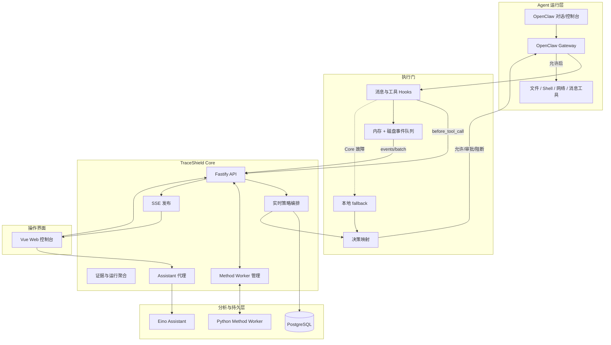

# 总体架构

## 分层视图

TraceShield 按运行位置分为五层：宿主 Agent、执行门、审计 Core、分析与存储、操作界面。

## 组件间协议

| 来源 | 目标 | 协议 | 关键语义 |
| --- | --- | --- | --- |
| OpenClaw 插件 | Core | HTTP JSON | 同步审计与异步事件批次 |
| Core | 插件 | HTTP JSON | 四级决策、风险、理由、规则与审批描述 |
| Core | Web | HTTP JSON | 会话、运行、工具、证据、图谱与统计 |
| Core | Web | SSE | 实时审计与事件通知，不保证断线补发 |
| Core | Method Worker | stdin/stdout NDJSON | 长期子进程、按 request ID 关联响应 |
| Web | Core | POST + SSE 响应 | Assistant 流式对话 |
| Core | Eino | HTTP + SSE | 代理健康和流式模型输出 |
| 插件 | 本地磁盘 | 单事件 JSON 文件 | 异步上报失败时的补传队列 |

## 同步与异步的刻意分离

执行前安全判断属于同步路径。它必须快速返回明确动作，失败时有保守语义。消息、结果和调查证据属于异步路径，它们可以批量、重试和最终一致，但不能阻塞正常对话。

这种分离带来三个结果：

- Core 同步审计成功不代表 `after_tool_call` 已到达；工具节点可能暂时处于 `pending`。
- 异步事件补传不会重新执行工具，只补齐审计记录。
- SSE 只是控制台通知通道，不是持久事件总线；权威状态仍需通过查询 API 读取 PostgreSQL。

## 故障隔离

| 故障 | 同步工具行为 | 证据行为 | 控制台表现 |
| --- | --- | --- | --- |
| PostgreSQL 不可用 | Core 审计失败，插件进入 fallback | 批次落到插件磁盘队列 | Core health `ok=false` |
| Method Worker 不可用，`shadow` | legacy 决策正常返回 | Method evaluation 记录 unavailable/error | 方法状态不可用，基础审计仍工作 |
| Method Worker 不可用，`enforce` | Core 回退 legacy | 可记录 Method 故障状态 | 响应 engine 为 legacy |
| Eino/模型不可用 | 不影响工具执行门 | 不影响审计写入 | `/assistant` 失败，其他页面正常 |
| Web 不可用 | 插件与 Core 继续工作 | 证据继续入库 | 仅失去可视化入口 |
| Core SSE 中断 | 不改变同步决策 | 数据仍写 PostgreSQL | EventSource 重连或 HTTPS 轮询 |

## 部署拓扑

### 单机开发

所有组件运行在一台 Linux 主机；插件、Core 与 Assistant 使用 loopback 地址，浏览器访问 `5173`。

### 虚拟机演示

组件运行在虚拟机；宿主浏览器通过虚拟机 IP 访问 Web。OpenClaw 控制台优先通过 SSH 转发映射为宿主 `localhost`，既避免 HTTP 安全上下文问题，也不需要直接扩大 Gateway 暴露面。

### 后续生产化

当前代码是单机可信网络形态。要进入多用户或公网环境，需要在 Core 前增加身份、授权、TLS、限流和租户边界，并将 SSE 与内存队列替换或扩展为可共享的消息基础设施。当前版本不要直接把 `8787` 暴露在不可信公网。

## 设计中的权威来源

- 工具是否执行：插件接收到的同步 Core 决策，或 Core 不可用时的插件 fallback。
- 审计事实：PostgreSQL 中已提交的结构化记录。
- 风险图：优先使用最新成功 Method 图；没有时使用 Core 生成的 legacy 线性图。
- 控制台卡片：Core 统计接口，或明确标注的前端演示数据。
- Assistant 回答：非权威解释；不能覆盖 Core 决策。

