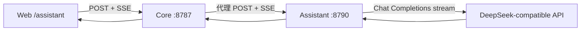

# Eino Assistant 服务架构

TraceShield Assistant 是独立 Go 服务，通过 CloudWeGo Eino 的 ChatModel 抽象调用 DeepSeek 兼容接口，为 Web 控制台提供只读流式安全解释。

## 准确定位

当前使用：

- Eino `BaseChatModel`；
- Eino OpenAI-compatible 模型适配；
- Eino message schema 与 StreamReader；
- HTTP SSE 输出。

当前没有：

- 工具调用；
- Agent Runner 或 Graph 编排；
- RAG/向量检索；
- 服务端会话记忆；
- 人工审批节点；
- 修改 Core 决策的能力。

因此它是“基于 Eino ChatModel 的只读安全分析助手”，并为未来安全 Agent 预留服务和界面边界。

## 调用链



浏览器不直接访问 8790，模型 key 只存在 Assistant 进程。Core 会验证请求与健康响应，并隐藏上游错误正文。

## 目录

| 路径 | 职责 |
| --- | --- |
| `assistant-eino/cmd/server/main.go` | 加载配置、创建模型和 HTTP 服务 |
| `internal/config/config.go` | 环境变量、范围校验和 key 读取 |
| `internal/chat/model.go` | Eino 模型适配与流增量转换 |
| `internal/chat/prompt.go` | 只读系统边界和 context 包装 |
| `internal/httpapi/server.go` | 请求限制、SSE、CORS、重试、日志与恢复 |

Go module 指定 Go 1.22。核心 Eino 依赖在 `go.mod` 固定版本，升级时应同时跑 race test 和真实上游流回归。

## 路由

| 方法 | 路径 | 作用 |
| --- | --- | --- |
| `GET` | `/health` | 配置与模型对象状态 |
| `POST` | `/v1/chat/stream` | 流式对话 |
| `OPTIONS` | `/` | CORS 预检 |

服务默认只监听 `127.0.0.1:8790`。

## 启动

```bash
cd assistant-eino
go test ./...
mkdir -p bin
go build -o bin/traceshield-assistant ./cmd/server

TRACESHIELD_ASSISTANT_API_KEY_FILE=/absolute/path/to/local-key \
./bin/traceshield-assistant
```

验证：

```bash
curl -s http://127.0.0.1:8790/health | jq
curl -s http://127.0.0.1:8787/v1/assistant/health | jq
```

## 健康的限制

`configured=true` 只表示 API key 非空且 model 对象已构建。health 不调用上游，所以无法证明：

- 当前网络可达；
- 模型名有效；
- 账户有额度；
- 上游没有限流；
- 流能在超时内建立。

正式验收要发一条最小 chat stream，并确认收到 start、delta、done。

## 故障隔离

Assistant 或模型失败不会改变 OpenClaw 插件、Core 基础策略或 PostgreSQL 审计。它只影响 `/assistant` 页的解释能力。

这条隔离是设计要求：自然语言模型不应位于高风险工具的最低安全线内。

