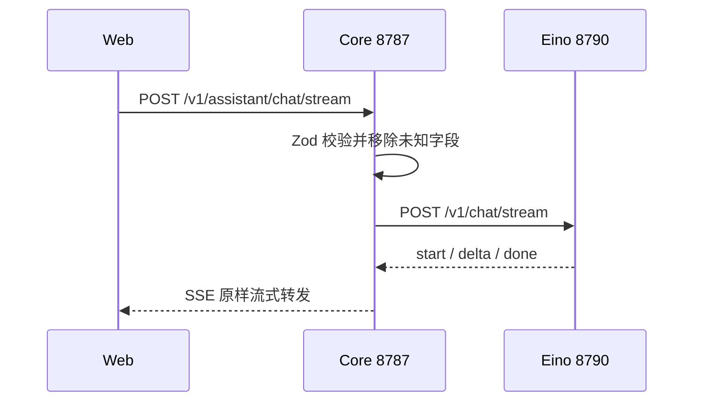

# Assistant 代理 API

浏览器不直接访问 Eino 服务。Core 校验请求、代理健康，并以字节流方式转发 SSE。



## 健康代理

### `GET /v1/assistant/health`

Core 请求上游 `/health` 并验证、白名单化响应：

```json
{
  "ok": true,
  "service": "traceshield-assistant-eino",
  "framework": "cloudwego-eino",
  "provider": "deepseek",
  "model": "deepseek-v4-flash",
  "configured": true
}
```

Assistant health 只表示 key 已配置且模型适配器已构建，不会主动请求模型上游。

## 流式对话

### `POST /v1/assistant/chat/stream`

```json
{
  "conversation_id": "traceshield-case-001",
  "message": "请解释最近一次阻断的决定性证据。",
  "history": [
    {
      "role": "user",
      "content": "先总结风险路径。"
    },
    {
      "role": "assistant",
      "content": "当前路径包含敏感读取与外部发送。"
    }
  ],
  "context": {
    "run_id": "run-doc-001",
    "decision": "BLOCK",
    "matched_rules": ["deny_secret_file_read"]
  }
}
```

Core 约束：

- conversation ID 可选，1–300 字符；
- message 必填，1–32000 字符；
- history 最多 100 条；
- role 只能 user/assistant；
- 每条 history content 1–32000；
- context 是可选 object；
- 未声明字段被移除。

Eino 服务本身还有更严格的长度与 ID 字符约束，Web 当前生成的请求满足两层限制。

## SSE

```text
event: start
data: {"conversation_id":"traceshield-case-001","model":"deepseek-v4-flash"}

event: delta
data: {"content":"这次操作被阻断，"}

event: delta
data: {"content":"因为目标命中了敏感文件规则。"}

event: done
data: {"conversation_id":"traceshield-case-001","finish_reason":"stop"}
```

错误也使用 `event: error`。Core 检查上游必须是 `text/event-stream`，处理 Node backpressure，并在浏览器断开时取消上游。

## 公共错误

| HTTP/事件 code | 含义 |
| --- | --- |
| `invalid_assistant_request` | Core 请求校验失败 |
| `assistant_unavailable` | Assistant 不可达、响应无效或上游非 SSE |
| `assistant_timeout` | Core 代理整体超时 |
| `assistant_rate_limited` | 上游返回 429 |
| `assistant_stream_error` | SSE 建立后流被中断 |

Core 不向浏览器透传模型供应商原始错误正文，避免意外暴露敏感诊断信息。

## 超时

Core 默认 `60000 ms` 计时器覆盖整个上游流，不只是建流阶段。因此很长的模型输出也可能被中止。Eino 自身默认同样为 60 秒；调高时应同时考虑两层、反向代理和浏览器 UX。

## 安全边界

- Assistant 不是同步决策引擎；
- context 必须先在调用方最小化与脱敏；
- 模型回答不是审计事实；
- 当前 Core 路由没有用户认证和限流，非可信网络部署必须在代理层补充。

