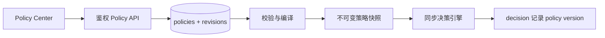

# 策略与决策

## 当前真正执行的规则

同步基础策略位于 `core/src/services/policyEngine.ts`，按固定顺序短路：

| 顺序 | 条件 | 动作 | 风险 | 规则 ID |
| --- | --- | --- | --- | --- |
| 1 | file read 或 shell 触达常见秘密 | BLOCK | critical | `deny_secret_file_read` |
| 2 | shell 含破坏性磁盘命令 | ASK | critical | `confirm_dangerous_shell_command` |
| 3 | 外部 HTTP/HTTPS URL | ASK | medium | `ask_external_network_request` |
| 4 | 工具名或种类 unknown | WARN | medium | `warn_unknown_tool` |
| 5 | 其他 | ALLOW | low | `default_allow` |

匹配输入由 tool name/kind、raw params、param summary、resource hint 和 risk hint 共同序列化得到。

## 敏感读取

当前识别：

- `.env` 及路径形式；
- `id_rsa`、`id_ed25519`；
- `private key` 的常见空格、下划线、连字符形式；
- `/etc/shadow`。

只在 `file_read` 或 `shell_exec` 工具种类触发，返回 BLOCK/critical。

## 破坏性 Shell

当前覆盖：

- 同时含递归与强制选项的 `rm`；
- `mkfs` 及带文件系统后缀形式；
- 含 `if=` 的 `dd`。

返回 ASK/critical，审批 30 秒，默认 BLOCK。

## 外部网络

引擎提取序列化文本中的第一个 HTTP/HTTPS URL。`localhost` 和 `127.*` 视为本地，其余主机都进入 ASK/medium，包括大多数局域网地址。

## policies 表的真实边界

迁移会 seed 四条与上述规则同名的 policy 记录，包含 enabled、priority 和 JSON config。当前决策代码**没有查询该表**，Core 也未注册 policy CRUD 路由。

因此：

- 数据库 `enabled=false` 不会关闭真实规则；
- priority 不改变匹配顺序；
- config patterns 不改变正则；
- Web 策略开关只保存在浏览器 localStorage；
- 页面显示“待同步”不代表 Core 会在之后自动应用。

这是当前演示层与执行层的明确分界。

## Method 与 safety floor

shadow 模式只记录 Method 建议。enforce 模式把 Method 建议映射为四级动作，并与 safety floor 比较；敏感访问至少 BLOCK，破坏性磁盘命令至少 ASK。

Method 异常回退基础策略，响应 `engine=legacy`。此行为与插件无法调用 Core 时的本地 fallback 不同。

## 新增真实规则

当前版本新增基础规则需要修改代码：

1. 在 `policyEngine.ts` 定义条件、动作、风险、理由和稳定规则 ID；
2. 决定它在短路顺序中的位置；
3. 如 enforce 也必须保底，在 `safetyFloor.ts` 加不可下调规则；
4. 更新 `seed_policies.sql` 作为展示目录；
5. 增加 Core 单元/冒烟测试；
6. 增加插件 mapping/fallback 测试；
7. 更新文档与演示数据；
8. 验证 ALLOW/WARN/ASK/BLOCK 四类不会意外变化。

## 动态策略中心的实现路线

要让前端开关真正生效，需要完整实现而非只增加 PATCH 路由：

至少需要版本化、schema 校验、并发更新、审计日志、回滚、安全底线、热加载原子性、权限控制与测试模式。生产策略变更不能只依赖浏览器 localStorage。

