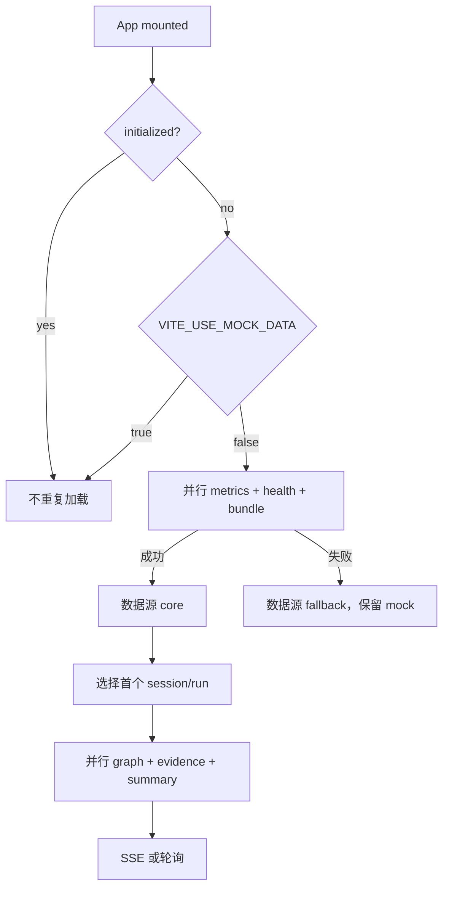

# 状态与 API

## Runtime Store

`web/src/stores/runtimeStore.ts` 保存：

- initialized/loading/error；
- `mock | core | fallback` 数据来源；
- sessions、runs、tool calls；
- graph nodes/edges、evidence；
- timeline、conversation；
- policies、metrics、Core status；
- active session/run/node/tab；
- SSE 状态/停止函数；
- HTTPS snapshot timer。

初始数据是 `runtimeMock.ts` 的深拷贝，真实请求成功后覆盖 Core 已支持的部分。

## 初始化



初始化只执行一次。首次 Core 不可用时，Store 进入 fallback，当前不会自动重试或建立 SSE；Core 恢复后一般需要刷新浏览器。

## 地址与 Mock

`src/api/client.ts`：

1. `VITE_TRACESHIELD_CORE_BASE_URL` 优先；
2. HTTPS 未配置时使用 `window.location.origin`；
3. HTTP 未配置时使用 `http://<当前 hostname>:8787`。

只有 `VITE_USE_MOCK_DATA` 精确等于字符串 `false` 才使用真实 Core。默认/缺失是 mock。

JSON 请求默认 5 秒 timeout，统一抛 `ApiError(status, path, message)`。

## 初始化请求

并行：

```text
GET /v1/dashboard/runtime-status
GET /v1/health
GET /v1/audit/sessions?filter=all
GET /v1/audit/events?limit=200
```

选择 run 后：

```text
GET /v1/runs/:runId/risk-graph
GET /v1/runs/:runId/evidence-path
GET /v1/runs/:runId/conversation-summary
```

任一初始化主请求失败都会让整组进入 fallback；详情请求失败只清空本次图/证据并显示错误。

## DTO 映射

### 决策

```text
BLOCK → block
ALLOW → allow
WARN/ASK/其他 → review
```

风险只接受 low/medium/high/critical；其他值回退 low。

### 工具调用

Core 的工具种类映射为 filesystem/shell/network/transform 等 UI 类别。真实 `latencyMs` 当前固定为 0，因为查询 API 没返回同步审计耗时；不要显示成真实 0ms 性能。

### 会话

通常用 session ID 作为标题。当前对长链种子 ID 有中文标题特例；新增可读标题应由 Core metadata 或稳定映射提供，避免在 Store 堆积 demo ID 判断。

### Dashboard

Core 返回 24h 和 total。`metric_window=history` 时 UI 使用 total，并标注“历史累计”“24 小时无新调用”和演示种子数量；不会把旧数据伪装成 24h 实时数据。

## Run 切换

`selectSession()` 找到 session 的首个 run，重置 tab 和 node，然后加载详情。风险图节点会与同 Run tool calls 比较风险并保留更高值，再按 tool ID 或 step sequence 补 evidence 关联。

## UI Store

`uiStore` 只保存布局折叠，不保存业务数据。把持久 UI preference 与运行审计分开，避免 localStorage 覆盖 Core 权威状态。

## Policy API 的当前状态

前端已经定义 GET/POST/PATCH `/v1/policies`，但 Core 没注册这些路径。页面 localStorage 是有意的演示 fallback，不是离线写队列。

实现真实 API 时必须更新：

- Core 路由和鉴权；
- policy version/并发控制；
- Web 的错误与同步状态；
- 真实引擎加载；
- localStorage 迁移；
- 此指南的策略边界。

## 新 API 映射约定

- 接口文件定义 wire DTO；
- 显式转换 snake_case、enum 与 nullable；
- 组件只使用 UI domain type；
- 时间在转换层统一格式化或保留 ISO；
- 错误保留 path/status 便于诊断；
- 不把 raw payload 直接塞进 Store；
- 给真实、历史、演示与 fallback 数据加可见 source。

