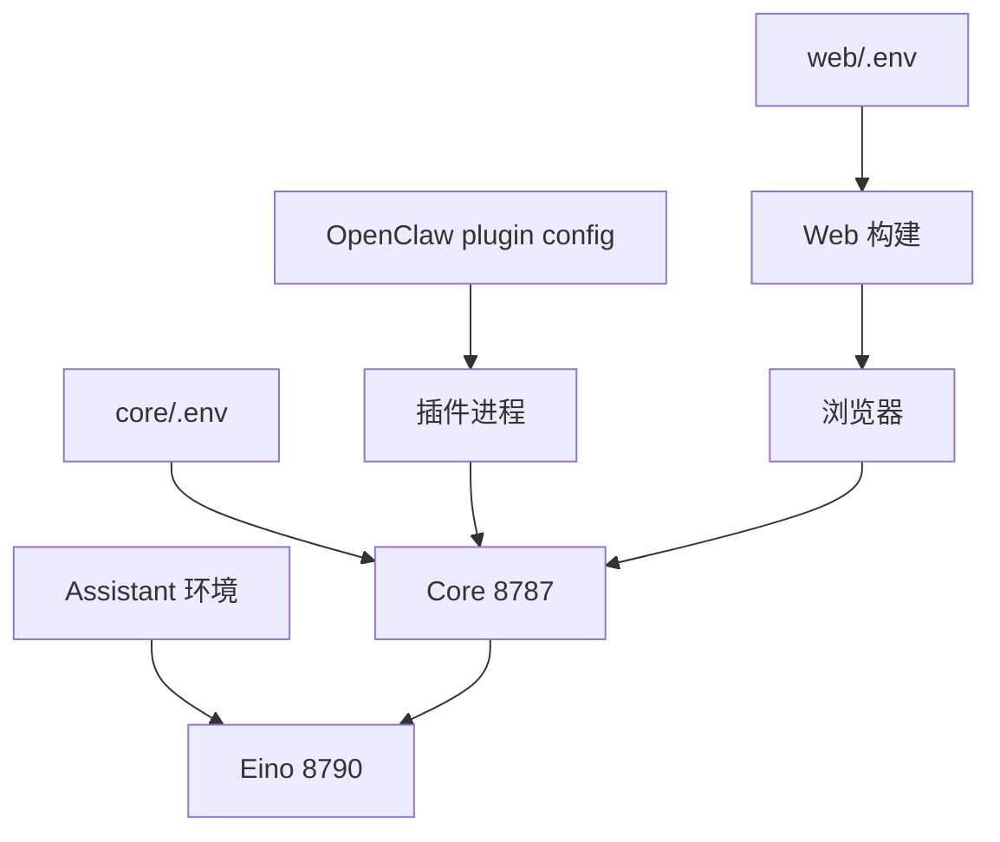

# 配置总览

TraceShield 的配置分布在四个运行单元中：Core `.env`、Web Vite 环境、Eino Assistant 环境变量和 OpenClaw 插件配置。配置的权威字段见各组件源码；本页说明它们如何组合。

## 配置流向



## Core

从模板开始：

```bash
cp -n core/.env.example core/.env
```

最小必需字段是 `TRACESHIELD_DATABASE_URL`，其余均有默认值。推荐开发配置：

```dotenv
TRACESHIELD_DATABASE_URL=postgresql://<user>:<password>@127.0.0.1:5432/<database>
TRACESHIELD_CORE_PORT=8787
TRACESHIELD_ENGINE_MODE=shadow
TRACESHIELD_SAVE_RAW_PAYLOAD=false
TRACESHIELD_SAVE_RAW_PARAMS=false
TRACESHIELD_SAVE_RAW_RESULT=false
TRACESHIELD_ASSISTANT_BASE_URL=http://127.0.0.1:8790
```

所有原始数据开关默认必须保持 `false`。只有在隔离环境、使用非敏感测试数据且明确需要诊断时才短时开启。

## Web

Vite 环境变量在构建时注入：

```dotenv
VITE_TRACESHIELD_CORE_BASE_URL=http://127.0.0.1:8787
VITE_USE_MOCK_DATA=false
```

- `VITE_USE_MOCK_DATA=false` 才会调用真实 Core；未写或其他值会使用前端 Mock。
- HTTP 页面未配置 Core URL 时，浏览器默认请求当前 hostname 的 `8787`。
- HTTPS 页面未配置 Core URL 时，浏览器默认同源请求，由公开展示网关代理允许的路径。
- 修改 Vite 环境后必须重新构建或重启开发服务。

## Eino Assistant

Assistant 的 key 来源优先级：

1. `TRACESHIELD_ASSISTANT_API_KEY`
2. `DEEPSEEK_API_KEY`
3. `TRACESHIELD_ASSISTANT_API_KEY_FILE` 指向的文件

建议使用文件路径或服务管理器的凭据机制，不把 key 写进仓库文件。模型、输出限制、上下文限制与 CORS 见[模型配置](../assistant/model-config.md)。

## OpenClaw 插件

优先级为：

1. OpenClaw 传入的插件配置；
2. 同名 `TRACESHIELD_*` 环境变量；
3. 源码默认值。

插件默认连接 `http://127.0.0.1:8787`，审计超时 `400 ms`，异步上报间隔 `2000 ms`，本地降级开启，完整载荷关闭。完整字段见[插件配置](../integrations/plugin-config.md)。

## 地址选择原则

- 插件与 Core 在同一台机器：始终优先 `127.0.0.1:8787`，不受虚拟机 DHCP 地址变化影响。
- Core 与 Assistant 同机：Assistant 保持 `127.0.0.1:8790`。
- 宿主浏览器访问虚拟机 Web：Web 使用虚拟机 IP，浏览器调用的 Core URL 也必须对宿主可达。
- 公网展示：只通过受控反向代理开放必要的只读或 Assistant 白名单路径，不直接暴露 Core 全部写接口。

## 配置变更后的重载

| 变更 | 必须执行 |
| --- | --- |
| Core `.env` | 重启 Core |
| Web `.env` | 重新构建并重启 Web |
| Assistant 环境 | 重启 Assistant |
| 插件源码 | `npm run build` 后重启 Gateway |
| OpenClaw 插件配置 | 重启 Gateway |
| Method YAML/代码 | 重启 Core，确保 Worker 重建 |
| 数据库迁移 | 执行 `npm --prefix core run db:migrate` |

## 配置验收

不要只看进程是否存在。依次检查：

```bash
curl --fail --silent http://127.0.0.1:8787/v1/health
curl --fail --silent http://127.0.0.1:8787/v1/method/status
curl --fail --silent http://127.0.0.1:8787/v1/assistant/health
```

OpenClaw 侧还需确认插件注册日志和 `traceshield_status` 输出；Web 侧确认顶部 Core、数据库、实时流状态与实际接口一致。

