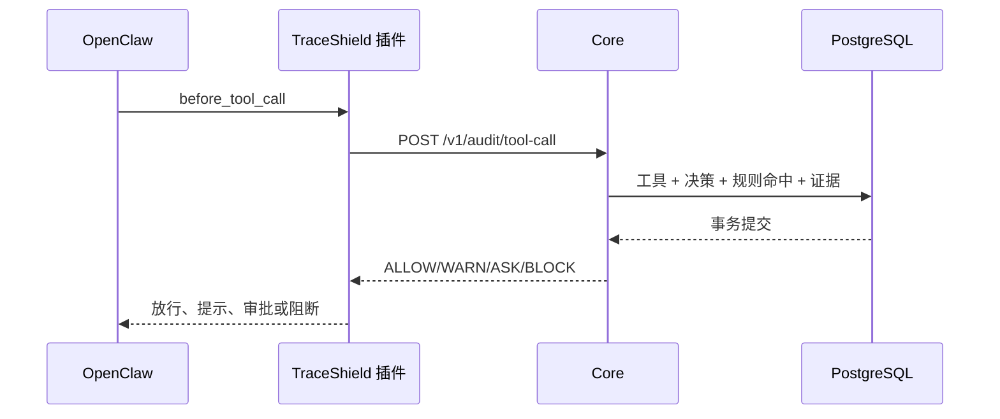

# 系统概览

TraceShield 是一个位于 Agent 运行时与工具执行之间的安全审计层。它把 OpenClaw 中的消息、工具调用和工具结果组织为统一的运行记录，在工具执行前同步给出决策，在执行后异步补齐证据，并通过 Web 控制台提供查询、图谱和调查入口。

## 核心目标

TraceShield 解决的不是“模型回答是否正确”，而是“Agent 准备做什么、是否允许做、做完后留下了什么证据”。项目围绕五个目标设计：

1. **执行前控制**：高风险工具在真正执行前必须经过 Core 审计。
2. **明确结果**：统一使用 `ALLOW`、`WARN`、`ASK`、`BLOCK` 四类动作。
3. **失效安全**：Core 超时或不可达时，高风险动作不能静默放行。
4. **最小采集**：默认保存摘要、预览和哈希，不保存完整敏感载荷。
5. **可复盘**：一次运行中的消息、工具、策略、证据和风险路径可以关联查询。

## 组件职责

| 组件 | 目录 | 主要职责 | 默认端口 |
| --- | --- | --- | --- |
| OpenClaw 插件 | `openclaw-plugin/` | 注册 Hook、同步审计、决策映射、异步上报、本地降级 | 无独立端口 |
| Core | `core/` | API、策略裁决、事务写入、查询、SSE、方法 Worker 管理 | `8787` |
| PostgreSQL | `docker-compose.yml` | 审计会话、运行、事件、工具、决策、证据和方法结果 | `5432` |
| Method Worker | `core/method-engine/` | 按运行轨迹进行语义映射、链路分析和方法评估 | 无独立端口 |
| Web 控制台 | `web/` | 运行审计、会话、工具、策略演示、证据、风险和 Assistant UI | `5173` |
| Eino Assistant | `assistant-eino/` | 调用模型生成只读安全解释，输出 SSE 增量 | `8790`，默认仅本机 |

## 两条主链路

### 同步控制链

这条链路在执行路径上，延迟与失败语义都很重要。插件默认审计超时为 `400 ms`。超时并不表示操作自动成功，而是进入本地降级判断。

### 异步证据链

消息、模型输出、`before_tool_call`、`after_tool_call`、运行结束和降级决策先进入插件内存队列，默认每 `2 s` 批量发送到 `/v1/events/batch`。失败时事件写入磁盘队列，Core 恢复后继续补传。`event_id` 是幂等键，重复批次不会重复入库。

## 四级决策

| 动作 | 运行时含义 | 当前典型场景 |
| --- | --- | --- |
| `ALLOW` | 继续执行 | 未命中限制的普通调用 |
| `WARN` | 继续执行并留下告警 | 未知工具 |
| `ASK` | 请求显式审批；默认超时拒绝 | 破坏性 Shell、外部网络访问 |
| `BLOCK` | 执行前阻断 | `.env`、私钥、`/etc/shadow` 等敏感读取 |

决策严重度独立使用 `low`、`medium`、`high`、`critical`。一次 Run 的最终动作和风险级别按最严格结果聚合。

## 开发者需要先记住的边界

- Method 默认运行在 `shadow`，此时它生成评估和图谱，但实际工具裁决仍由基础策略给出。
- `enforce` 会让 Method 建议参与裁决，同时保留不可下调的安全底线；Method 故障时回退基础策略。
- Web 策略中心当前开关是展示状态，不会更新 Core 策略或改变真实结果。
- Eino Assistant 没有工具权限，只能解释调用方传入的摘要上下文。
- `mock-core/` 不包含数据库、图谱和真实查询能力，不应与完整 Core 同时占用 `8787`。

## 下一步

- 第一次启动：阅读[环境要求](prerequisites.md)和[五分钟启动](quickstart.md)。
- 开发插件：阅读[Hook 与执行门](../integrations/plugin-hooks.md)。
- 接口接入：从[Core 职责](../core/overview.md)进入各 API 章节。
- 修改方法逻辑：阅读[方法引擎](../architecture/method-engine.md)。

