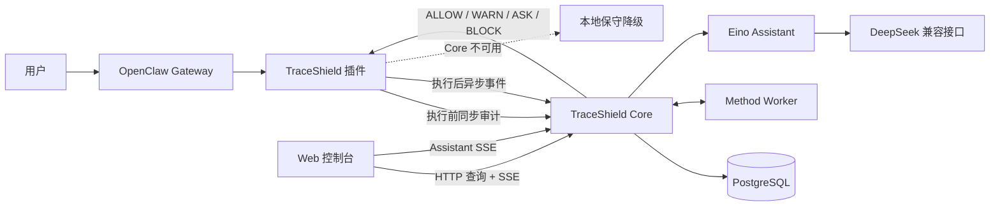

  

    
    

      <h1>TraceShield 开发者指南</h1>
      
面向 Agent 工具调用的运行时安全审计系统：执行前决策、执行后留痕、风险链分析、可视化调查与本地保守降级。

    

  

  

    OpenClaw Runtime Gate
    Fastify + PostgreSQL
    Vue 3 Console
    Eino Assistant
  

## 你能在这里找到什么

本指南是当前仓库的开发入口。它从代码、数据库迁移、接口校验器和运行脚本中整理而成，目标是让新开发者无需依赖历史材料，也能独立完成启动、开发、联调、测试和部署。

-   :material-rocket-launch:{ .lg .middle } **从零启动**

    ---

    准备 PostgreSQL、Core、方法 Worker、Web、Eino Assistant 和 OpenClaw 插件，并逐层验证健康状态。

    [:octicons-arrow-right-24: 五分钟启动](getting-started/quickstart.md)

-   :material-shield-lock-outline:{ .lg .middle } **理解执行门**

    ---

    跟踪一次工具调用如何经过 `before_tool_call`、同步审计、四级决策、审批或阻断，再形成证据链。

    [:octicons-arrow-right-24: 运行时请求链](architecture/request-lifecycle.md)

-   :material-api:{ .lg .middle } **接入 Core API**

    ---

    查阅审计、事件、查询、图谱、实时流、方法评估与安全助手代理接口。

    [:octicons-arrow-right-24: Core API](core/overview.md)

-   :material-puzzle-outline:{ .lg .middle } **集成 OpenClaw**

    ---

    构建插件、配置加载路径、理解 Hook 优先级、降级策略、磁盘补传和双 Profile 对照演示。

    [:octicons-arrow-right-24: OpenClaw 接入](integrations/openclaw.md)

-   :material-monitor-dashboard:{ .lg .middle } **扩展控制台**

    ---

    了解路由、Pinia 状态、Core API 映射、SSE/轮询更新以及风险图与 Inspector 联动。

    [:octicons-arrow-right-24: 前端架构](frontend/overview.md)

-   :material-server-security:{ .lg .middle } **可靠运行**

    ---

    使用用户级 systemd 持久托管，执行发布前检查，定位数据库、实时流、审计超时和模型上游故障。

    [:octicons-arrow-right-24: 运维部署](operations/local-deployment.md)

## 系统全景

TraceShield 不替代 Agent 或模型。它位于 Agent 与工具执行之间，为高风险操作增加一个可观测、可审批、可阻断的运行时安全层；同时把消息、工具、结果、决策和证据组织成可以复盘的运行记录。

## 当前实现边界

| 能力 | 当前状态 | 权威来源 |
| --- | --- | --- |
| 工具调用前同步审计 | 已实现 | `openclaw-plugin` + Core `/v1/audit/tool-call` |
| `ALLOW/WARN/ASK/BLOCK` 映射 | 已实现 | 插件决策映射与 OpenClaw Hook |
| PostgreSQL 审计留痕 | 已实现 | Core 数据库迁移与事件摄取服务 |
| SSE 实时流 | 本地 HTTP 已实现 | Core `/v1/stream/audit-events` |
| HTTPS 展示入口更新 | 当前使用 10 秒轮询 | Web Runtime Store |
| 方法引擎 | `legacy/shadow/enforce` 三模式 | Core Runtime Orchestrator |
| Eino 安全助手 | 只读对话，未注册工具 | `assistant-eino` |
| 策略中心开关 | 控制台演示状态 | 浏览器本地状态，不改变 Core 实际裁决 |
| `mock-core` | 仅保留旧联调用途 | 不是当前完整系统链路 |

!!! important "先区分真实能力与演示能力"
    控制台中的策略开关是演示交互；真实同步裁决来自 Core 当前代码与数据库策略基线。Eino Assistant 只能解释传入的摘要，不能修改策略、批准请求或访问数据库。详细限制见[已知边界](reference/limitations.md)。

## 推荐阅读顺序

1. [系统概览](getting-started/overview.md)：建立组件与端口认知。
2. [五分钟启动](getting-started/quickstart.md)：把最小完整链路跑通。
3. [运行时请求链](architecture/request-lifecycle.md)：理解同步控制与异步证据两条链路。
4. [同步审计 API](core/audit-api.md) 和 [Hook 与执行门](integrations/plugin-hooks.md)：开始开发集成。
5. [测试与发布检查](operations/testing.md)：在提交前完成分层验证。

## 文档原则

- 只陈述 TraceShield 仓库当前实现及明确标注的后续边界。
- 示例标识符、地址和凭据均为占位符，不能直接用于生产。
- 所有原始敏感载荷保存开关默认关闭；文档示例不会包含真实秘密。
- 代码行为发生变化时，文档与自动化验证应在同一次变更中更新。

