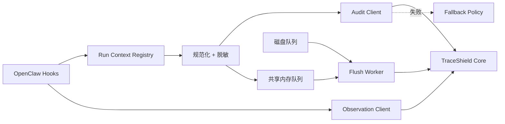

# OpenClaw 插件概览

TraceShield 以 OpenClaw 插件形式进入 Agent 运行时。插件没有独立服务端口，随 Gateway 进程加载，在关键 Hook 上同步控制或异步采集。

## 构建

```bash
npm --prefix openclaw-plugin ci
npm --prefix openclaw-plugin run typecheck
npm --prefix openclaw-plugin run test
npm --prefix openclaw-plugin run build
```

入口是 `openclaw-plugin/dist/index.js`。`dist/` 不提交 Git，新 clone 和源码变更后都必须本地构建。

## 加载

在目标 OpenClaw profile 中把插件目录加入 load paths，并启用插件：

```bash
PLUGIN_PATH=/absolute/path/to/TraceShield/openclaw-plugin

openclaw config set \
  plugins.load.paths \
  "[\"${PLUGIN_PATH}\"]" \
  --strict-json

openclaw config set \
  'plugins.entries["traceshield-security-plugin"].enabled' \
  true --strict-json

openclaw config set \
  'plugins.entries["traceshield-security-plugin"].config.core_base_url' \
  'http://127.0.0.1:8787'

openclaw config set \
  tools.alsoAllow \
  '["traceshield_status"]' \
  --strict-json
```

上面是干净 Profile 的最小示例。`plugins.load.paths` 和 `tools.alsoAllow` 都是数组；已有其他插件或允许工具时，应读取现值后合并，不能直接用示例覆盖。

重启 Gateway 后验证：

```bash
openclaw config validate
openclaw plugins inspect traceshield-security-plugin
openclaw plugins doctor
openclaw health
```

预期插件状态为 `loaded`，Gateway 日志包含注册 Core URL、audit timeout 和 fallback 的信息。

## 注册能力

入口 `openclaw-plugin/src/index.ts` 注册：

1. `traceshield_status` 工具；
2. 异步事件 Flush Worker；
3. `before_prompt_build` 安全说明；
4. Agent Tool Result Middleware；
5. OpenClaw Security Audit Collector；
6. 消息/模型事件 Hook；
7. `before_tool_call` 同步审计；
8. `after_tool_call` 结果留痕和 Observation 检测。

## 插件进程内结构



OpenClaw 可能在 Gateway 与 Agent Turn 构建阶段多次注册插件。事件队列和 Run Registry 使用进程级共享状态，避免每次注册创建互不相知的队列。

## 关联策略

Run Context Registry：

- 优先复用 OpenClaw 提供的 session/run/trace/tool call ID；
- 缺失时生成稳定替代 ID；
- 同一 Run 的 `step_seq` 从 1 递增；
- tool result 优先按 tool call ID 关联；
- 没有 ID 时按待完成工具名匹配；
- 仍无法关联时标为 `unmatched`；
- context 默认保留 30 分钟；
- `agent_end` 标记运行结束。

开发新的 Hook 适配时，要保证同步 AuditRequest 与异步 before/after event 复用同一工具 ID，否则 Core 无法合并结果。

## traceshield_status

该工具显示：

- 插件已加载；
- 配置的 Core URL；
- 同步审计等待上限；
- fallback 配置；
- full-payload 调试开关；
- 当前内存队列数量。

它不会主动检查 Core、数据库、Method，也不统计磁盘队列。`Core URL` 只是配置值，不代表健康。

status 自身也是工具调用：执行前先进入 `before_tool_call` 并入队，所以常显示 1 条队列事件；Core 在线时它可能因 unknown kind 获得 WARN。不要把 `Audit timeout: 400ms` 误读为“刚发生超时”。

## 真实验证

```bash
journalctl --user -u openclaw-gateway -n 150 --no-pager \
  | rg 'TraceShield|http server listening|agent model'
```

端到端至少验证：普通读取 ALLOW、敏感读取 BLOCK、危险 Shell ASK、外部网络 ASK、Core 故障时本地 fallback。只运行 `demo:openclaw` 不等于真实 Gateway 已加载插件。
