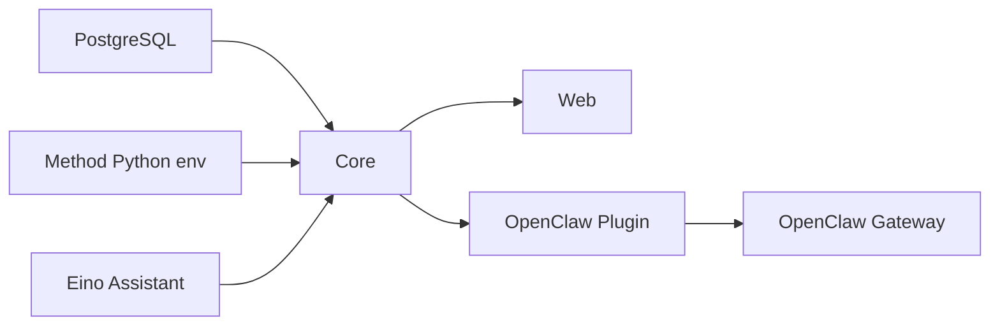

# 本地与虚拟机部署

## 启动依赖图



Gateway 可以在 Core 故障时启动并使用 fallback，但完整审计链仍需要 PostgreSQL 和 Core 健康。

## 首次安装

```bash
git clone git@github.com:potato-vita/TraceShield.git
cd TraceShield

npm --prefix core ci
npm --prefix web ci
npm --prefix openclaw-plugin ci
go -C assistant-eino mod download

python3 -m venv core/method-engine/.venv
core/method-engine/.venv/bin/python -m pip install \
  -r core/method-engine/requirements-runtime.lock \
  -r core/method-engine/requirements-dev.lock
```

## 数据库

```bash
docker compose up -d --wait postgres
cp -n core/.env.example core/.env
npm --prefix core run db:migrate
npm --prefix core run db:check
```

不要只检查容器名称，要确认 health：

```bash
docker compose ps postgres
```

## Assistant

不需要 AI 对话时可以暂不启动；同步安全门不依赖它。

```bash
cd assistant-eino
go test ./...
mkdir -p bin
go build -o bin/traceshield-assistant ./cmd/server

TRACESHIELD_ASSISTANT_API_KEY_FILE=/absolute/path/to/local-key \
./bin/traceshield-assistant
```

## Core

另开终端：

```bash
npm --prefix core run dev
```

完整 health：

```bash
curl -s http://127.0.0.1:8787/v1/health \
  | jq -e '.ok == true and .db_connected == true'
curl -s http://127.0.0.1:8787/v1/method/status | jq
```

Core health 在数据库断开时仍返回 HTTP 200，所以不能只用 `curl --fail`。

## Web

真实数据配置：

```dotenv
VITE_TRACESHIELD_CORE_BASE_URL=http://127.0.0.1:8787
VITE_USE_MOCK_DATA=false
```

本机开发：

```bash
npm --prefix web run dev
```

虚拟机局域网演示建议生产构建：

```bash
npm --prefix web run build
npm --prefix web run preview -- --host 0.0.0.0 --port 5173
```

宿主打开 `http://<VM_IP>:5173`。

## 插件与 Gateway

```bash
npm --prefix openclaw-plugin run build
```

按[OpenClaw 插件概览](../integrations/openclaw.md)设置 load path、enabled、Core URL 和 fallback，然后重启 Gateway。

## 虚拟机网络

获取 IP：

```bash
ip -4 -brief address
```

推荐开放：

- `5173/tcp` 给宿主浏览器；
- `18789/tcp` 仅在确需 LAN 直连 Gateway 时开放；
- `8787/tcp` 只有调试或 Web 直连需要；
- 不向宿主开放 `8790`；
- PostgreSQL `5432` 只在必要的开发工具场景开放。

如使用 UFW，根据宿主在虚拟网段的确切 IP 收窄来源：

```bash
sudo ufw allow from <HOST_IP> to any port 5173 proto tcp
```

## OpenClaw 宿主访问

最稳妥是 SSH 转发：

```bash
ssh -N -L 18789:127.0.0.1:18789 <vm-user>@<vm-ip>
```

然后宿主打开 `http://localhost:18789`，按 OpenClaw UI 要求输入 token 和完成设备确认。不要把 token 写进文档、脚本或录屏。

## 启动后验收

```bash
docker compose ps postgres
curl -s http://127.0.0.1:8787/v1/health | jq -e '.ok and .db_connected'
npm --prefix core run method:health
curl -s http://127.0.0.1:8790/health | jq
curl -I http://127.0.0.1:5173/runtime
openclaw health
openclaw plugins inspect traceshield-security-plugin
```

最后发一条安全测试工具调用，在 Runtime 中确认 session、tool、decision、evidence 和图谱都出现。

## 停止

前台进程 `Ctrl+C`。数据库保留数据：

```bash
docker compose stop postgres
```

不要在日常停止中使用 `docker compose down -v`。
