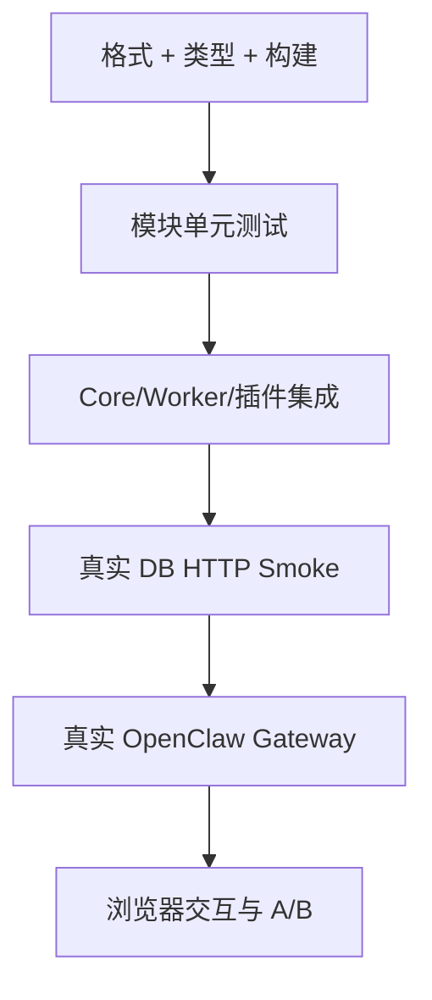

# 测试与发布检查

## 测试分层



## Core

```bash
npm --prefix core run typecheck
npm --prefix core run test
npm --prefix core run build
```

覆盖 Method 协议/并发/超时/重启、Intent、Trace、safety floor、Assistant proxy、SSE CORS/heartbeat 和 Dashboard window。

真实服务运行后：

```bash
npm --prefix core run smoke
```

Smoke 验证 health、常规/敏感/危险/网络决策、step ordering、消息/结果投影、Run 完成、Dashboard、timeline、图、evidence 和 decision detail。

## Method

```bash
npm --prefix core run method:test
npm --prefix core run method:health
```

需要性能与规则回归：

```bash
npm --prefix core run method:replay
npm --prefix core run method:report
```

后两者会写报告文件，不是纯只读检查。CI 中应把输出放到 artifact 或临时目录，避免污染工作树。

## OpenClaw 插件

```bash
npm --prefix openclaw-plugin run format:check
npm --prefix openclaw-plugin run typecheck
npm --prefix openclaw-plugin run test
npm --prefix openclaw-plugin run build
```

Core 在线时：

```bash
npm --prefix openclaw-plugin run demo:core
```

它是真实 Core HTTP 联调，但不是 Gateway Hook 验证。仍需重启 Gateway 并从 OpenClaw UI 发真实工具调用。

## Eino Assistant

```bash
cd assistant-eino
gofmt -w ./cmd ./internal
go test ./...
go test -race ./...
go vet ./...
go build ./cmd/server
```

覆盖配置、key 文件、Eino stream、thinking 参数、请求验证、CORS、日志脱敏、建流重试、取消与超时。

## Web 与公共网关

```bash
npm --prefix web run typecheck
npm --prefix web run build
npm --prefix web run smoke
node --test web/scripts/publicGateway.test.mjs
```

当前 Web 没有组件单元和浏览器 E2E。因此需要人工检查：

- 所有路由打开；
- 主导航/Runtime/Assistant 左右栏折叠；
- HTTP SSE 与 HTTPS polling 标签；
- Runtime 图缩放与证据联动；
- Policy localStorage 演示提示；
- Assistant start/delta/done/stop/retry；
- Core 初始化失败与恢复刷新；
- 1180/1250/1380/1680 px。

## 文档

```bash
cd developer-guide
. .venv/bin/activate
mkdocs build --strict
```

## 发布前完整矩阵

```bash
npm --prefix core run typecheck
npm --prefix core run test
npm --prefix core run build
npm --prefix core run method:test

npm --prefix openclaw-plugin run format:check
npm --prefix openclaw-plugin run typecheck
npm --prefix openclaw-plugin run test
npm --prefix openclaw-plugin run build

npm --prefix web run typecheck
npm --prefix web run build
npm --prefix web run smoke
node --test web/scripts/publicGateway.test.mjs

(cd assistant-eino && go test ./... && go test -race ./... && go vet ./... && go build ./cmd/server)

git diff --check
```

服务启动后再跑 DB migrate/check、Core smoke、Method health、实际 Assistant stream 和 OpenClaw A/B。

## 安全回归用例

| 场景 | Core 在线 | Core 故障 fallback |
| --- | --- | --- |
| 公开 README 读取 | ALLOW | 当前通常 ASK，除非 allow cache |
| `.env` 读取 | BLOCK | BLOCK |
| 普通 `ls` Shell | ALLOW | BLOCK |
| 破坏性磁盘命令 | ASK | BLOCK |
| 外部 URL | ASK | BLOCK |
| unknown tool | WARN | ASK |
| 注入内容后外发 | shadow Method BLOCK suggestion；实际基础决策取决于当前步 | 高风险种类 BLOCK |

测试断言要区分实际 decision、Method suggestion 与 fallback decision。

## 发布门槛

- 所有自动化通过；
- 数据库迁移可在空库和已有库重复执行；
- raw 开关仍默认 false；
- fallback 仍为 true；
- 没有 key/token/绝对个人路径进入 diff；
- 文档严格构建；
- 实际 Gateway 日志确认插件 loaded；
- 一条敏感读取在工具执行前明确 BLOCK；
- Runtime 能查询到对应 decision/evidence。

